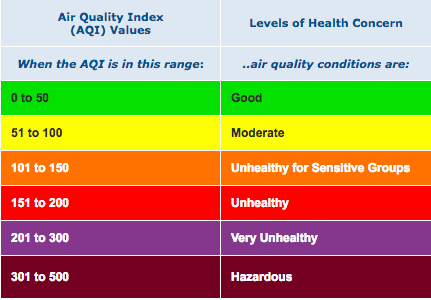

```{r, message=FALSE, echo=FALSE, warning=FALSE}
library(readr)
library(dplyr)
library(data.table)
library(httr)
library(rjson)
library(ggplot2)
library(usmap)
library(RColorBrewer)
library(rgdal)
library(ggrepel)
library(plotly)
library(tidyr)
library(stringr)
library(ggpubr)
```


# Introduction

  With the recent events of covid cases on the rise and steadly holding just barely and with the rise of fires all over California with the sky being orange miles away from the fire for days, this year has definitely been so unusual and unprecedented times. The Corona virus has been found to inhibit respiratory functions of the host and with the recent fires the air quality within many cities of the 58 counties has sky rocketed to concerning levels. Depending on someone’s geographical location and which county they live in, their health could already be at risk due to the air quality alone. Would this make a subject more vulnerable to contracting covid if their respiratory function was already inhibited? My hypothesis that I want to further explore is whether there is an association between air quality and confirmed cases of covid amongst people within the counties of California.

# Methods

  The data sets that I have used in my analysis were from three different extrenal sources consisting of John Hopkins University's github repository of [daily covid cases]("https://raw.githubusercontent.com/CSSEGISandData/COVID-19/master/csse_covid_19_data/csse_covid_19_time_series/time_series_covid19_confirmed_US.csv") by geolocation. The github repository has different datasets of deaths and confirmed cases within the United States from the corona virus and is a compilation from news article sources such as New York Times and Los Angeles Times, as well as Public Health departments of the different counties. Daily Air Quality Index and PM 2.5 concentrations were from the [Enviornmental Protection Agency (EPA)](https://www.epa.gov/outdoor-air-quality-data/download-daily-data). Air Quality Index is measured on a scale from 0 to 500, where it measures the change of pollution in the air, see the figure below to reference the different cutoffs and categories we usually see on our weather and map applications on our phones. PM 2.5 pollutants are small microscopic particles within the air such as dust, spores, pollen, and ash which measure about 2.5 $\mu$m (micrometers) in diameter. Within the EPA's website I queried for my own results for all recording sites within the state of interest being California as PM 2.5 being the pollutant. I have found that the query directly from the EPA's website was much more accurate and updated more frequently than downloading their daily datasets through their API. I have also gathered [US Census data](https://www.census.gov/data/tables/time-series/demo/popest/2010s-counties-detail.html) of predicted 2019 estimates of  populations, gender, and race within every county in California.




## Daily Covid Cases
```{r Covid Github, message=FALSE, warning=FALSE, echo=FALSE}
download.file("https://raw.githubusercontent.com/CSSEGISandData/COVID-19/master/csse_covid_19_data/csse_covid_19_time_series/time_series_covid19_confirmed_US.csv", "time_series_covid19_confirmed_US.csv", method="libcurl", timeout = 60)

covidGithub <- data.table::fread("time_series_covid19_confirmed_US.csv")
```

```{r, echo=FALSE}
# Applying filter to only select covid confirmed cases in California
covidGithub <- covidGithub%>%
  filter(Province_State == 'California')%>%
  rename(county = Admin2)

covidGithub <- covidGithub[ !(covidGithub$county %in% c('Unassigned', 'Out of CA')), ]
```

```{r Melting Covid Data Set, message = FALSE, warning = FALSE, echo=FALSE}
# Attempt to melt covid to long format
covidGithubmelt <- melt(covidGithub, id = 1:11, variable.name = 'Date', variable.factor = FALSE,
                        value.name = 'Confirmed')
covidGithubmelt$Date <- as.Date(covidGithubmelt$Date, format = "%m/%d/%y")

# Group by counties and order by date of dataset print out
covidGithubmelt <- covidGithubmelt%>%
  group_by(county)%>%
  arrange(Date, .by_group = TRUE)
```

```{r New Cases Varible, warning=FALSE, echo=FALSE}
# format the state variable
county_list <- unique(covidGithubmelt$county)
covidGithubmelt$county <- factor(covidGithubmelt$county, levels = county_list)

# Add variables for new_cases:
for (i in 1:length(county_list)) {
  cvd_subset = subset(covidGithubmelt, county == county_list[i])
  cvd_subset = cvd_subset[order(cvd_subset$Date),]

  # add starting level for new cases and deaths
  cvd_subset$new_cases = covidGithubmelt$Confirmed[1]

  for (j in 2:nrow(cvd_subset)) {
    cvd_subset$new_cases[j] =  cvd_subset$Confirmed[j] - cvd_subset$Confirmed[j-1] 
  }

  # include in main dataset
  covidGithubmelt$new_cases[covidGithubmelt$county == county_list[i]] = cvd_subset$new_cases
}
```

  In data wrangling and cleaning the daily covid data we were originally provided 60 observations 1 observation for each county. However, there are only 58 total counties within California, looking more into this the covid dataset has included people who were from 'unassigned' counties and 'Out of CA', which could represent NA or an omitted response from the person who contracted the virus as well as people who tested positive within California, but are not a resident of California. I have exluded these observations to be exlusive corona virus cases within California for easier match of datasets between counties. We also observe from the raw csv file is that the data is recorded for each day across every county and each new day is a column, with a total of 319 columns as of 11/25 which is reporting data from the previous day. To match a very wide dataset to others such as the AQI from the EPA's website it needs to be transformed into a longitidinal dataset with dates as columns and the value of covid cases falling into that day as its own value column which is labeled as `Confirmed` for total confirmed cases. This was eaily done by using the `melt()` function which we kept our other variables as our ID factors with `Date` being transformed into the new column and chronologically ordered by each county. Our raw dataset is the grand total of cases since the beginning of the pandemic, a grand total accumulation of cases up until that particular date. This particular variable of `Confirmed` cases would cause overinflation and I have made a for loop to iterate for each date for every county, taking the subtraction of current covid cases from the previous day to get the incidence or `new_cases` for that day. As we see in *Figure 1* the green line represents Los Angeles county and has the largest spike and cyclical trends compared to the other counties. Population of Los Angeles county could be a huge factor in why such a huge difference in cases. A better reference is on my website homepage with interactive text of county and incidence cases. What sticks out the most is the blue line going past the 0 y-axis, which indicates that San Bernadino county had the largest difference from the previous day where there was fewer reported cases. This trend is what we hope to see in the nearby future.

**Figure 1: Incidence Cases Across the Pandemic** 
```{r COVID Visual by County, warning=FALSE, message=FALSE, echo=FALSE}
# Time series visual of incidence cases from the start of the pandemic
ggplot(covidGithubmelt, aes(Date, new_cases, color = county))+
  geom_line()+
  geom_point(size = .5, alpha = 0.5)+
  labs(y = 'New Cases')+
  theme(legend.position = 'none')
#title = 'Incidences of Covid Cases in California by County',
```

```{r, echo=FALSE, warning=FALSE, message=FALSE}
# Adjusting Merge data set to ggmap setting with only FIPS and Confirmed variables 
mapdf <- covidGithubmelt%>%
  filter(Date == as.Date(max(Date)))%>%
  select(FIPS, Date, new_cases, Confirmed)%>%
  distinct()%>%
  rename(fips = FIPS)
```

**Figure 2: Incidence Cases**
```{r Spatial Visualization of COVID by County, warning=FALSE, echo=FALSE}
plot_usmap(data = mapdf, values='new_cases', include = 'CA')+
  scale_fill_continuous(low = 'white', high = 'red', name = 'Confirmed Cases', label = scales::comma)+
  labs(subtitle = 'Source: Johns Hopkins University Center \n for Systems Science and Engineering (JHU CSSE)', caption = paste('As of ', as.Date(max(mapdf$Date))))+
  theme(plot.title = element_text(hjust = 0.5, vjust = 0.25, size = 18), legend.position = "right",
        legend.title = element_text(size = 14), legend.text = element_text(size = 12))
#title = 'Incidence Cases \n by California County',
```

**Figure 3: Prevalence of Confirmed Cases**
```{r Grand Total Confirmed Cases, warning=FALSE, echo=FALSE}
plot_usmap(data = mapdf, values='Confirmed', include = 'CA')+
  scale_fill_continuous(low = 'white', high = 'red', name = 'Confirmed Cases', label = scales::comma)+
  labs(subtitle = 'Source: Johns Hopkins University Center \n for Systems Science and Engineering (JHU CSSE)', caption = paste('As of ', as.Date(max(mapdf$Date))))+
  theme(plot.title = element_text(hjust = 0.5, vjust = 0.25, size = 18), legend.position = "right",
        legend.title = element_text(size = 14), legend.text = element_text(size = 12))
#title = 'Total Cases in California \n by County',
```

  Our daily cases dataset also provides the `FIPS` or Federal Information Processing Standards for every county within California. The `FIPS` is a 5 digit code with the first two representing the state such as California being 06 alphabetically and the next three digits being the particular county such as 037 being for Los Angeles county. With the `FIPS` variable being included in our dataset I used `plot_usmap()` function to spatially model the incidence cases of the virus with each county. *Figure 2* provides a density plot of all the counties in California with the previous day's data of covid cases, we also see from *Figure 3* with the grand total prevalence of old and new cases being relatively the same density plot of California with the exception that San Bernadino county is not nearly as red for cases compared to the grand total of cases during the eight months of the pandemic. In both figures we see that Los Angeles county is the brightest and most dense for covid cases within the whole state and does not surprise us as the county has the most people and population per capita.

## US Census data of California
```{r Population Visualizations, warning=FALSE, message=FALSE, echo=FALSE}
CAcensus <- read_csv("data/cc-est2019-alldata-06.csv")
```

```{r, echo=FALSE}
# 2019 Population Estimate of each CA county from US Census
CApop <- CAcensus%>%
  filter(YEAR == 12)%>%
  mutate(OT_MALE = IA_MALE+NA_MALE,
         OT_FEMALE = IA_FEMALE+NA_FEMALE)%>%
  select(COUNTY, STNAME, CTYNAME, YEAR, AGEGRP, TOT_POP, TOT_MALE, TOT_FEMALE, WA_MALE,
         WA_FEMALE, BA_MALE, BA_FEMALE, H_MALE, H_FEMALE, AA_MALE, AA_FEMALE, OT_MALE,
         OT_FEMALE)%>%
  mutate(White = WA_MALE + WA_FEMALE, Black = BA_MALE + BA_FEMALE, Hispanic = H_MALE + H_FEMALE,
         Asian = AA_MALE + AA_FEMALE, Other = OT_MALE + OT_FEMALE,
         Age = case_when(AGEGRP <= 0 ~ 0,
                         AGEGRP <= 4 ~ 1,
                         AGEGRP <= 13 ~ 2,
                         AGEGRP <= 18 ~ 3))

CApop$COUNTY <- paste0(6, CApop$COUNTY)
CApop$Age <- factor(CApop$Age)

race_pop <- CApop%>%
  group_by(COUNTY, CTYNAME, Age)%>%
  summarise_at(vars(TOT_POP, TOT_MALE, TOT_FEMALE, White, Black, Hispanic, Asian, Other), sum)

test1 <- race_pop%>%
  group_by(COUNTY, CTYNAME, Age)%>%
  summarise_at(vars(TOT_POP), mean)

age_pct <- test1%>%
  spread(Age, TOT_POP)%>%
  group_by(COUNTY)%>%
  mutate(pct_19 = `1`/`0`,
         pct_2064 = `2`/`0`,
         pct_65over = `3`/`0`)

race_pop <- race_pop%>%
  filter(Age == 0)%>%
  select(-Age)

demo_pop <- merge(race_pop, age_pct, by = c('CTYNAME', 'COUNTY'))
demo_pop <- demo_pop%>%
  select(-c(`0`,`1`,`2`,`3`))
         
# Spatial map of CA county population densities
Popmapdf <- demo_pop%>%
  select(COUNTY, TOT_POP)%>%
  rename(fips = COUNTY)
```

  From the US Census data its raw dataset is overwhelming and rather large with each county's demographic populations such as age group, gender, and race from every year since the 2010 census and population estimates following that until this years census which the data is not publicly available yet. The breakdown of each variable from the raw download can be found within the pdf file in the data folder of my github repository. I chose the 2019 population estimates to get the closest population estimates to this current year to draw analysis from as these estimates would mimic the real populations within each county for 2020. In the raw dataset there are already variables of `Total_Male` and `Total_Female` with race being brokendown to gender as well. I made the summation of gender grouped by my race of interest being `White`, `Black`, `Asian`, `Hispanic`, and `Other` which consists of Native American and Native Hawaiian populations. I have also recoded the age group variables to include only 3 categories such as age groups 19 and under, 20 to 64, and 65 and over. I grouped each of my new age group variables by county and age group and then summed to gather the grand total within each age group and race for that age group, and then have calculated the perecentages of the age group populations. `pct_19` which accounts for populations 19 and under as $\frac{\text{TOT_POP}_\text{AGEGRP1}}{\text{TOT_POP}}$ to get the percentage from the total population within the county.

**Figure 4: County Populations Within California**
```{r, warning=FALSE, echo=FALSE}
plot_usmap(data = Popmapdf, values='TOT_POP', include = 'CA')+
  scale_fill_continuous(low = 'white', high = 'blue', name = 'Population', label = scales::comma)+
  labs(subtitle = 'Source: US Census')+
  theme(plot.title = element_text(hjust = 0.5, vjust = 0.25, size = 18), legend.position = "right",
        legend.title = element_text(size = 14), legend.text = element_text(size = 12))
#title = '2019 County \n Population Estimates', 
```

As we see in *Figure 4* Los Angeles county is by far the greatest in size with over 10 million residents, along with Orange, San Diego, San Bernadino, and Riverside counties as being the most dense for population. Referencing my website will give interactive displays of each county and the actual 2019 population estimates within. Population can be a potential confounding variable for the relationship of air quality on the number of covid cases. The more dense the county is in population would call for more traffic and vechile smog pollution and mamy vecotrs of spread ammongst people.

```{r COVID vs Population Density, echo=FALSE}
# Applying filter for the most current covid data
covidGithubmelt_today <- covidGithubmelt%>%
  filter(Date == as.Date(max(Date)))

CApop_today <- demo_pop%>%
  rename(FIPS = COUNTY)

# Merging the grand total of covid cases with county population
cvd_pop<- merge(covidGithubmelt_today, CApop_today, by = 'FIPS')

cvd_pop$per1k = as.numeric(format(round(cvd_pop$Confirmed/(cvd_pop$TOT_POP/1000),1),
                                      nsmall=1))
```

## Enviornmental Protection Agency (EPA) Air Quality Index
```{r, message=FALSE, echo=FALSE}
# Daily AQI for every county in California
csvAQI_data <- read_csv("data/ad_viz_plotval_data.csv")
```

```{r AQi Visual Setup, echo=FALSE}
csvAQI_data$Date <- as.Date(csvAQI_data$Date, format = "%m/%d/%y")

# Group by counties and order by date of dataset print out
csvAQI_data <- csvAQI_data%>%
  group_by(COUNTY)%>%
  arrange(Date, .by_group = TRUE)
```

```{r AQI Setup, echo=FALSE}
AQI <- csvAQI_data%>%
  select(Date, COUNTY, `Daily Mean PM2.5 Concentration`, DAILY_AQI_VALUE, COUNTY_CODE)%>%
  group_by(Date, COUNTY)%>%
  mutate(MeanPM2.5 = mean(`Daily Mean PM2.5 Concentration`), MeanAQI = mean(DAILY_AQI_VALUE))

AQI <- AQI%>%
  select(Date, COUNTY, COUNTY_CODE, MeanPM2.5, MeanAQI)%>%
  distinct()
```

  Preparing our Air Quality dataset to be merged with the US Census and daily covid cases I wrangled and cleaned the data matching the Date format. From the raw dataset I noticed that some counties have more daily recorded measures of AQI and PM 2.5 than others. Some counties may have had fewer daily recordings this year due to the virus leaving the sites unmanned or even by the fires that heavily affected some of the counties to have drastic AQI of over 500. In *Figure 5* we see the distribution of AQI for each county and can see the counties that have extraneous outliers. Counties such as Mariposa with the Creek Fire and Mono county with the Mountain View Fire. To account for the differences I averaged the daily AQI and PM2.5 measures by day for some counties are much larger than other and require more recording sites. Then I averaged the AQI and PM2.5 measures again from all the single daily averages to account for the size differences in counties. 

**Figure 5: Air Quality Within California**
```{r AQI Visual, message=FALSE, warning=FALSE, echo=FALSE}
# Averaged AQI for each county
ggplot(AQI, aes(COUNTY, MeanAQI, color = COUNTY))+
  geom_boxplot()+
  labs(title = 'Air Quality by California County', x = 'County', y = 'AQI Value')+
  theme(legend.position = 'none', axis.text.x = element_text(angle = 90))
```


**Figure 6: Combined Visuals**
```{r, echo=FALSE}
# Stacked visuals of both AQI over covid cases during the pandemic
line <- AQI%>%
  filter(COUNTY == 'Los Angeles')%>%
  ggplot(aes(Date, MeanAQI))+
  geom_line(color = 'Orange')+
  labs(title = 'Los Angeles County', y = 'AQI Value')

line2 <- covidGithubmelt%>%
  filter(county == 'Los Angeles')%>%
  ggplot(aes(Date, new_cases))+
  geom_line(color = 'Red')+
  labs(y = 'Daily Cases')

ggarrange(line, line2, nrow = 2)

```

  In comparing the two datasets of Air Quality and Daily covid cases in *Figure 6* aligning the two graphs to give an overlay starting at the beginning of the year with AQI and the start of the pandemic we see interesting trends of a spike happening in both datasets during the early days in the month of July most likely after the big holiday Fourth of July. This also shows the affect of air pollution on the number of covid cases as there were many fireworks shot in th sky contributing to more PM 2.5 pollutants there was also an increase in cases. In my website my interactive visual will give the actual number of AQI, covid cases, and the date this all occured in Los Angeles county.

```{r, echo=FALSE}
map_merge <- merge(mapdf, Popmapdf, by = 'fips')

map_merge <- map_merge%>%
  mutate(rate = Confirmed/TOT_POP,
         ratePer1k = rate * 1000)
```

**Figure 7: Attack Rate of Covid Cases**
```{r, message=FALSE, warning=FALSE, echo=FALSE}
# Incidence Rate of Covid Cases Normalized by County Population
plot_usmap(data = map_merge, values='ratePer1k', include = 'CA')+
  # scale_fill_distiller(type = 'qual',palette = 'YlOrRd')+
  scale_fill_continuous(low = 'white', high = 'red', name = 'Cases Per 1K Persons')+
  labs(caption = paste('As of ', as.Date(max(mapdf$Date))))+
  theme(plot.title = element_text(hjust = 0.5, vjust = 0.25, size = 18), legend.position = "right",
        legend.title = element_text(size = 14), legend.text = element_text(size = 12))
#title = 'Attack Rate \n of Covid Cases',
```


  One figure to draw attention to is *Figure 7* I combined the two datasets of the US Census data to get the `TOT_POP` of each county and daily covid cases to get the total number of prevalence cases `Confirmed`. I normalized the attack rate of number of people contracting covid by the population of the county, $\frac{\text{Confirmed}}{\text{TOT_POP}} \times 10000$ = `rateper1k`. Creating a spatial density map of California by county of the attack rate per 1,000 persons we can see how each county is compared to each other when accounting for their population size. We see that Imperial county has the highest attack rate of 85.9 per 1,000 persons and has a total population of 181,215, meaning that there would be approximately 86 people out of 1,000 within Imperial county would contract the corona virus. Also Kings county with an attack rate of 67 per 1,000 persons and has a total population of 152,940.

```{r AQI Table Preperation, echo=FALSE}
meanAQI <- AQI%>%
  group_by(COUNTY)%>%
  mutate(avgAQI = mean(MeanAQI), avgPM2.5 = mean(MeanPM2.5))%>%
  select(-c('Date', 'MeanPM2.5', 'MeanAQI'))%>%
  rename(FIPS = COUNTY_CODE)%>%
  distinct()

meanAQI$FIPS <- paste0(6, meanAQI$FIPS)
```

**Table 1: AQI County Categories**
```{r, echo=FALSE}
meanAQItable <- meanAQI%>%
  select(-FIPS)%>%
  mutate(Category = case_when(avgAQI < 50 ~ 'Good',
                              avgAQI < 100 ~ 'Moderate',
                              avgAQI < 150 ~ 'Unhealthy for Sensitive Groups',
                              avgAQI < 200 ~ 'Unhealthy',
                              avgAQI < 300 ~ 'Very Unhealthy',
                              avgAQI < 500 ~ 'Hazardous'))%>%
  rename(County = COUNTY, Mean_AQI = avgAQI, Mean_PM2.5 = avgPM2.5)

meanAQItable <- as.data.frame(meanAQItable)

knitr::kable(meanAQItable)

```

# Results

```{r Model Table Merge, echo=FALSE}
# Removing unnecessary variables
cvd_pop <- cvd_pop%>%
  select(-c(2:5, 7:11, 15))
  
meanAQI <- meanAQI%>%
  rename(county = COUNTY)

data_table <- merge(cvd_pop, meanAQI, by = c('FIPS', 'county'))
```

```{r, echo = FALSE}
mod <- glm(Confirmed ~ TOT_MALE + TOT_FEMALE +
             White + Black + Hispanic + Asian + Other +
             pct_19 + pct_2064 + pct_65over +
             avgAQI + avgPM2.5 +
             offset(log(TOT_POP)), family = poisson, data = data_table)

mod2 <- glm(Confirmed ~ TOT_MALE + TOT_FEMALE +
             White + Black + Hispanic + Asian + Other +
             pct_19 + pct_2064 +
             avgAQI + avgPM2.5 +
             offset(log(TOT_POP)), family = poisson, data = data_table)

```

```{r, echo=FALSE}
mod3 <- MASS::glm.nb(Confirmed ~ TOT_MALE + TOT_FEMALE +
                       White + Black + Hispanic + Asian + Other +
                       pct_19 + pct_2064 +
                       avgAQI + avgPM2.5 +
                       offset(log(TOT_POP)), link = log, data = data_table)
```

**Table 2: Preliminary Poisson Model**
```{r, echo=FALSE}
knitr::kable(
tibble(parameter = names(mod2$coefficients),
       rr = exp(mod2$coefficients),
       as.data.frame.matrix(exp(confint.default(mod2))),
       pvalue = summary(mod2)$coefficients[,4])
)
```

**Table 3: Final Negative Binomial Model**
```{r, echo=FALSE}
knitr::kable(
tibble(parameter = names(mod3$coefficients),
       rr = exp(mod3$coefficients),
       as.data.frame.matrix(exp(confint.default(mod3))),
       pvalue = summary(mod3)$coefficients[,4])
)
```

```{r, echo=FALSE, eval=FALSE}
pois_pearson_gof <-
  function(model) {
    return(
      list(
        pval = tibble(
          pred = predict(model, type = "response"),
          y = model$y
        ) %>%
          {sum((.$y - .$pred)^2/.$pred)} %>%
          pchisq(., model$df.residual, lower.tail = F),
        df = model$df.residual
      )
    )
  }

pois_dev_gof <-
  function(model) {
    return(
      list(
        pval = pchisq(model$deviance, model$df.residual, lower.tail=F),
        df = model$df.residual
      )
    )
  }

AER::dispersiontest(mod2)

pois_pearson_gof(mod3)
pois_dev_gof(mod3)
```

  In combing all three datasets of daily covid cases, EPA daily air quality data, and the US Census of demogrpahic populations I decided to run a poisson model running a full model with all my variables included as `Confirmed` cases as my predicted y variable $\hat{y}$. A Poisson model would be most appropriate because the count data of confirmed cases is strictly [0, $\infty$) as our other variables as well, with the Poisson model I can also include an offset variable of `TOT_POP` to normalize every county in California to obtain the attack rate. The first Poisson model ran with all variables being statistically significant with a p-value less than our significance level of 0.05. However, `pct_65over` was not statistically significant and I continued the next model exluding this variable. We find in *Table 2* the relative ratios for all the variables except for `pct_19` and `pct_2064` are relatively null. Meaning that the percentage of age groups 19 and younger, and 20 to 64 are at a much higher risk of contracting covid. The AIC for the Poisson model is 19757 which is extremly high and does not compare well with other models if they were to have a lower AIC, as a lower value would indicate a better fit. Another measure of checking our model's fit is the dispersion test $H_0: \tau = 0$ and $H_a: \tau \ne 0$, our model has a dispersion of 408.63 and a p-value of 0.0013 which rejects the null hypothesis and we can conclude that there is overdispersion. 

  Oversidpersion would cause our model to have smaller significance in our paramters as our p-value would be smaller and cause our estimated standard errors to be smaller than what is true. A Negative Binomial model would account for such an overdispersion and we see an improvement in our full model excluding `pct_65over` with the offset of `TOT_POP` as our AIC value is much lower at 917.30 with our $\theta = 12.63$. In testing our model's goodness of fit, the deviance GOF test does not show any departure from good fit as our p-value is not significant with a value of 0.0856.
  
# Discussion
  The year 2020 will forever be memorable with all the more peculiar as the US Census was administered and I believe we will have better accounts of the true population in 2020 compared to the algorithm generated 2019 population estimate and even more hidden trends discovered. For future notes on running this model with the 2020 US Census day would be to administer interaction effects for the age groups and race to see if its significant in its relation with attack ratio of corona virus. I would include other variables such as population density per square mile to get the idea of how crowded or spacious other counties are with their populations and with the closer proximity of people how that effects the attack ratio of contracting covid. Also to get a better understanding of how air pollution directly relates to the contracting of the virus to include a lag time of 14 days when a patient was diagnosed with the virus and comparing the air quality 14 days prior of their diagnostic screening.
